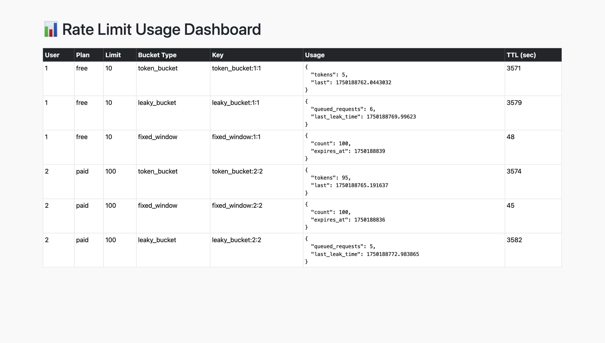

# 🚦 Rate Limiting System in Ruby on Rails

This project demonstrates three industry-grade rate limiting strategies — **Fixed Window**, **Token Bucket**, and **Leaky Bucket** — implemented in a Ruby on Rails application, backed by **Redis** for efficient storage and real-time control.

A built-in **admin dashboard** visualizes user activity and rate limit usage with auto-refreshing stats.

---

## ✨ Features

- ✅ Supports 3 algorithms: Fixed Window, Token Bucket, and Leaky Bucket
- ✅ Per-user and per-plan rate limit configuration
- ✅ Redis-backed, memory-efficient and fast
- ✅ Real-time usage tracking with TTL support
- ✅ Bootstrap 5.3-based dashboard with auto-refresh
- ✅ Easily extendable to support quotas, billing, or analytics

---

## 🧠 Rate Limiting Algorithms Explained

### 1. 🔁 Fixed Window Counter

- **What it is**: Allows `N` requests every fixed time window (e.g., per minute).
- **How it works**: Uses a Redis key with TTL to track request counts.
- **When to use**: Simple limits where exact time alignment doesn't matter.

🧪 Example:
```bash
Limit: 10 requests/minute
Behavior: After 10th request, all others get 429 until the minute resets
```

### 2. 🪙 Token Bucket

- What it is: Allows short bursts while enforcing average rate over time.
- How it works: Each user has a "bucket" of tokens; tokens refill over time.
- When to use: Public APIs, burst-tolerant services like GitHub or OpenAI.

🧪 Example:

```bash
Rate: 1 token/sec, Burst: 10
You can hit the API 10 times instantly, then 1/sec thereafter
```

### 3. 🚰 Leaky Bucket

- What it is: Enforces a steady outflow rate, queues requests at a constant rate.
- How it works: Maintains a queue and processes at a fixed drain rate.
- When to use: Background jobs, billing systems, payment gateways, QoS.

🧪 Example:

```bash
Drain rate: 1 request/sec, Queue size: 10
Requests beyond the queue are dropped with 429
```

## 📊 Live Usage Dashboard

All rate limiter buckets are visualized in real-time through a web-based dashboard:

- Bootstrap 5.3-based responsive UI
- Refreshes every 5 seconds via AJAX
- Shows:
    - Bucket type
    - Usage stats
    - TTL remaining
    - Redis key per user

### 📸 Screenshots

Below is a live snapshot of the real-time rate limiting dashboard powered by Bootstrap 5.3 and AJAX refresh:



> This dashboard displays per-user usage across all rate limiter strategies (Fixed, Token, Leaky) with TTL, Redis key, and usage state in real time.

## 🔧 Tech Stack

| Layer        | Technology                    |
|--------------|-------------------------------|
| Backend      | Ruby on Rails (API + Views)   |
| Rate Storage | Redis                         |
| Dashboard    | Bootstrap 5.3 + Vanilla JS    |
| Database     | PostgreSQL (for users/plans)  |
| Middleware   | Custom Rack/Service classes   |

## 🚀 Getting Started

### 1. Install dependencies

```bash
bundle install
```

### 2. Setup database

```bash
rails db:create db:migrate db:seed
```

### 3. Run Redis

```bash
brew install redis
brew services start redis
```

### 4. Start the server

```bash
rails server
```

### 5. Access the Dashboard

```bash
http://localhost:3000/dashboard
```

### 📁 Directory Structure

```bash
app/
  services/
    fixed_window.rb
    token_bucket.rb
    leaky_bucket.rb
  controllers/
    ping_controller.rb
    usage_controller.rb
    dashboard_controller.rb
  views/
    dashboard/index.html.erb
```

## 🧪 Testing with Apache Benchmark

To simulate high-frequency or burst traffic and verify the rate limiter behavior, you can use [`ab`](https://httpd.apache.org/docs/2.4/programs/ab.html) (Apache Benchmark).

### 🔧 Install Apache Benchmark (macOS)

```bash
brew install httpd
```

This will install ab (Apache Benchmark), typically available at `/opt/homebrew/bin/ab`.

### 🚀 Test Examples

You can run the following commands to test different rate limiter types for different users:

#### 🔁 Token Bucket

```bash
ab -n 5 -c 1 -H "User-Id: 1" -H "Bucket-Type: token_bucket" http://localhost:3000/ping
ab -n 105 -c 1 -H "User-Id: 2" -H "Bucket-Type: token_bucket" http://localhost:3000/ping
```

#### 🚰 Leaky Bucket

```bash
ab -n 5 -c 1 -H "User-Id: 1" -H "Bucket-Type: leaky_bucket" http://localhost:3000/ping
ab -n 95 -c 1 -H "User-Id: 2" -H "Bucket-Type: leaky_bucket" http://localhost:3000/ping
```

#### 🔒 Fixed Window

```bash
ab -n 5 -c 1 -H "User-Id: 1" -H "Bucket-Type: fixed_window" http://localhost:3000/ping
ab -n 50 -c 1 -H "User-Id: 2" -H "Bucket-Type: fixed_window" http://localhost:3000/ping
```

- `-n`: Total number of requests to make
- `-c`: Number of multiple requests to perform at a time (concurrency)
- `-H`: Custom headers to pass for User ID and Bucket Type

You should start seeing `429 Too Many Requests` responses once the limits are hit, depending on the bucket algorithm and user plan.

## 📌 Customization Ideas

- Add monthly quotas alongside burst limits
- Store analytics in PostgreSQL for billing
- Integrate email alerts for quota overage
- Add per-endpoint token costs (e.g., /execute = 5 tokens)

## 📄 License

MIT License
